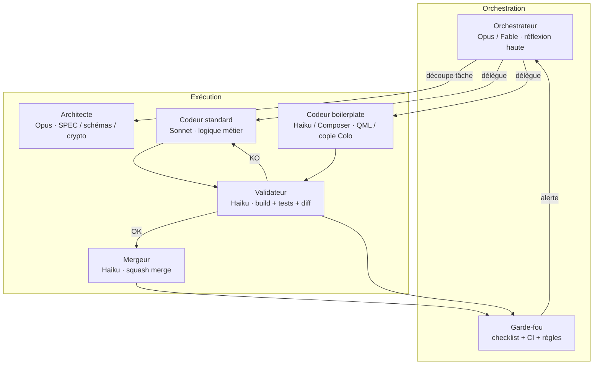

# Open_punch_clock — Plan de développement

> **Référence unique du projet.** Toute session agent commence par lire ce fichier.
> Pour le détail technique : `docs/SPEC.md` (à rédiger en tâche 0.1).
> Ne pas re-discuter les décisions actées ci-dessous.

## 1. Le produit

Alternative **open source** (GPLv3) à [Time Squared / Time Clock: Easy Tracker](https://play.google.com/store/apps/details?id=co.timesquared.timetracker) — sans pub, sans achat in-app, données sous contrôle de l'utilisateur.

### 1.1 Positionnement

| Time Squared (propriétaire) | Open_punch_clock |
|---|---|
| Pub + achats in-app | Gratuit, open source |
| Sync cloud propriétaire | Sync E2E chiffrée (infra Colo Course) |
| Export XLSX | Export CSV + XLSX (libre) |
| GPS, widgets, rappels | Même périmètre fonctionnel, phase par phase |
| iOS | **Hors scope v1** — Qt Android + Linux desktop |

### 1.2 Fonctionnalités cibles (parité MVP → v1)

**MVP (phase 3–4)** — utilisable au quotidien en solo :

- Pointage **Clock In / Clock Out** en un tap
- État « en service » persistant (survit redémarrage / batterie)
- **Time cards** manuelles (début, fin, pause, notes)
- **Projets / clients / emplois** avec taux horaire
- Estimation gains en temps réel pendant le pointage
- Historique journalier / hebdomadaire
- Export **CSV** des feuilles de temps
- Notifications de rappel (clock-out oublié, début de shift)
- Thème clair / sombre, FR + EN

**v1 (phase 5–7)** — parité Time Squared utile :

- Pauses configurables (durée par défaut, multiples pauses)
- Tags, notes, remboursements / déductions sur time cards
- Rapports hebdo / mensuels, période de paie, heures sup
- Export **XLSX** (feuille de temps partageable)
- **Sync multi-appareils** E2E (même stack Nostr que Colo Course)
- Sauvegarde / restauration (ZIP chiffré)
- Widget Android rapide (clock in/out sans ouvrir l'app)
- GPS optionnel au punch (opt-in explicite, stockage local)
- Historique des modifications (audit local)

**v2+ (backlog)** :

- Partage employeur ↔ employés (canal dédié)
- Import depuis export Time Squared
- AppImage + APK via colo-apps (auto-update)
- macOS / Windows si demande

### 1.3 Principes produit

1. **Offline-first** — tout fonctionne sans réseau ; la sync est un bonus.
2. **Simplicité** — le punch du jour doit tenir en 2 taps ; la complexité reste dans les écrans avancés.
3. **Pas de piège UX** — gros boutons Punch In/Out/Break bien séparés (le feedback Time Squared sur les pubs qui déplacent les boutons est un anti-pattern explicite).
4. **Vie privée** — pas de télémétrie ; GPS et sync cloud désactivés par défaut.

---

## 2. Architecture (décisions actées)

### 2.1 Stack technique

Reprise massive de **[Colo_Course](https://github.com/Poisson48/Colo_Course)** :

| Couche | Source Colo Course | Adaptation punch clock |
|---|---|---|
| UI | Qt 6 / QML, Material | Renommer module `OpenPunchClock`, palette « bureau / chantier » |
| Shell | `Main.qml`, `Theme`, `ColoDialog`, `ColoTextField`, `Icon` | Réutiliser tel quel (renommage progressif) |
| Persistance | `store/database.*`, SQLite WAL | Schéma `projects`, `time_entries`, `punch_state` |
| Sync (v1) | `syncengine`, `crdt`, `net/*`, chiffrement libsodium | Payload time-entry au lieu d'items courses |
| Notifications | `platform.*`, Android `Platform.java`, ntfy | Rappels punch, fin de pause |
| Export | `core/csv`, `core/zip` | + bibliothèque XLSX légère (à lister en §2.2) |
| Build | CMake, scripts AppImage + Android, CI GitHub | Copier workflows, changer IDs package |
| Updates | `updater.*`, colo-apps manifest | Entrée dédiée dans manifest colo-apps |

**Cibles v1** : Linux desktop (AppImage, dev principal) + Android (APK arm64).

### 2.2 Dépendances

**Reprises de Colo Course** : Qt 6 (Core, Quick, QuickControls2, Sql, WebSockets), libsodium, libsecp256k1.

**Nouvelles (à valider en 0.1)** :

| Dépendance | Usage | Justification |
|---|---|---|
| `QXlsx` ou équivalent header-only | Export XLSX | Parité Time Squared ; CSV seul insuffisant pour certains employeurs |
| Qt Positioning (optionnel) | GPS au punch | Module Qt officiel, compile-time flag `PUNCH_HAS_GPS` |

Toute nouvelle dépendance = ligne ajoutée ici + mention dans SPEC + revue garde-fou sécurité si réseau/crypto.

### 2.3 Modèle de données (aperçu — détail dans SPEC)

```
projects        — client/job : nom, taux horaire, couleur, défaut
time_entries    — entrée validée : project_id, start_ms, end_ms, breaks[], tags, notes,
                  reimbursements, deductions, source (punch|manual), ver CRDT
punch_state     — singleton local : clocked_in, current_project_id, clock_in_ms, break_start_ms
settings        — période de paie, rappels, GPS, locale, device_id
history         — audit local des modifications (non sync v1)
outbox / seen   — identique Colo Course si sync activée
```

Horodatage : **ms epoch `int64_t` partout** (convention Colo Course). Timers UI : `QTimer` + `real` en QML (overflow int64).

---

## 3. Orchestration multi-modèles et multi-agents

Le développement est piloté par un **Orchestrateur** qui délègue à des agents Cursor spécialisés, avec des modèles calibrés au coût / risque de chaque tâche.

### 3.1 Rôles



| Rôle | Modèle / agent | Quand l'utiliser | Interdit |
|---|---|---|---|
| **Orchestrateur** | Opus ou Fable, effort haut ; agent `generalPurpose` ou session utilisateur | Démarrage de phase, découpage de grosse feature, arbitrage après 2 échecs validateur, revue SPEC | Écrire du code applicatif directement |
| **Architecte** | Opus, effort haut ; agent `explore` puis rédaction SPEC | Tâches 0.x, schéma DB, protocole sync time-entry, export XLSX | Implémenter l'UI |
| **Codeur standard** | Sonnet effort normal ; agent `generalPurpose` | CRUD, modèles Qt, SyncEngine adapté, rapports, timers persistants | Merge sur `main`, modifier SPEC sans commit `docs:` séparé |
| **Codeur boilerplate** | Haiku ou Composer 2.5 fast ; agent `shell` pour scripts | Copier CMake/workflows Colo Course, QML répétitif, icônes, traductions bulk | Logique CRDT, crypto, calcul paie |
| **Validateur** | Haiku effort minimal ; agent `shell` (ctest) ou `ci-investigator` si CI rouge | Après chaque branche `feat/*` : build, tests, checklist §4 | Corriger le code (sauf typo doc) |
| **Mergeur** | Haiku ; agent `shell` | Squash merge si verdict OK | Merge sans verdict ; force push |
| **Garde-fou** | Règles automatisées + escalade Orchestrateur | Chaque PR / merge | Contournement checklist |

### 3.2 Matrice de délégation par type de tâche

| Type | Modèle | Agent Cursor | Exemple |
|---|---|---|---|
| Spec / protocole | Opus haut | explore → generalPurpose | 0.1 SPEC.md |
| Copie infra Colo Course | Haiku / Composer fast | shell | 1.1 CMake + CI |
| Schéma SQLite + migrations | Sonnet | generalPurpose | 1.2 |
| CRDT / sync | Sonnet ; revue Opus | generalPurpose + bugbot optionnel | 6.x |
| Écran QML simple | Haiku | generalPurpose | 3.2 SettingsPage |
 | Écran QML complexe (timer live, rapports) | Sonnet | generalPurpose | 3.1 PunchPage |
| Export XLSX | Sonnet | generalPurpose | 5.3 |
| Android widget / GPS | Sonnet | generalPurpose | 7.x |
| Debug CI | Haiku | ci-investigator | fix workflow |
| Revue sécurité sync | Opus | security-review (sur demande) | avant merge phase 6 |

### 3.3 Protocole de session agent

Chaque session reçoit un **brief minimal** (économie de tokens) :

```
1. Lire docs/PLAN.md (+ docs/SPEC.md si tâche ≥ 1.2)
2. Lire UNIQUEMENT les fichiers listés dans la tâche
3. Travailler sur branche feat/<slug> ou fix/<slug>
4. Produire : code + tests + mise à jour tableau §6 si merge imminent
5. Handoff validateur : résumé 5 lignes + commandes de test
```

L'**Orchestrateur** rédige ce brief quand l'utilisateur lance une phase ou une tâche.

### 3.4 Garde-fous (non négociables)

| # | Règle | Responsable |
|---|---|---|
| G1 | `main` toujours vert (build + ctest local) | Validateur |
| G2 | Aucun commit direct sur `main` (sauf `docs/` et `scripts/` trivial) | Mergeur |
| G3 | Diff limité au périmètre de la tâche — pas de refactor gratuit | Validateur |
| G4 | Nouvelle logique métier = tests unitaires ou QML | Codeur |
| G5 | Changement crypto / sync / GPS = revue Orchestrateur avant merge | Orchestrateur |
| G6 | Max **2** allers-retours Codeur↔Validateur ; puis escalade Opus | Orchestrateur |
| G7 | Pas de secret dans le dépôt (.env, keystores, clés) | Validateur + CI |
| G8 | Nouvelle dépendance = entrée §2.2 + SPEC | Architecte |
| G9 | Données utilisateur : migrations SQLite réversibles ou backup auto avant migration | Codeur standard |
| G10 | UX punch : boutons In/Out/Break ≥ 64 px touch, espacement fixe, pas de bannière au-dessus | Validateur UI |
| G11 | Tag sémantique `v*` seulement via workflow release (comme Colo Course) | Mergeur |
| G12 | Agent `bugbot` ou checklist §4 manuelle avant merge phases ≥ 5 | Orchestrateur |

### 3.5 Escalade

Monter vers **Opus effort haut** (Orchestrateur) si :

- Corruption / perte de données punch
- Conflit CRDT non résolu après 2 itérations
- Timer actif incorrect après kill process / reboot
- Échec CI non trivial (ci-investigator bloqué)
- Décision architecture non couverte par ce PLAN

---

## 4. Checklist validateur

1. **Build local** : `cmake -S . -B build -G Ninja && cmake --build build` — zéro warning nouveau.
2. **Tests** : `ctest --test-dir build` — 100 % vert.
3. **Périmètre** : le diff ne touche que la tâche annoncée.
4. **Tests ajoutés** pour : calcul durée, pauses, persistance punch_state, export CSV, merge CRDT (si sync).
5. **Smoke UI** (phases ≥ 3) : `scripts/validate-pc.sh` ou équivalent — app démarre, punch in/out manuel OK.
6. **Android** (phases ≥ 4) : build APK sans erreur ; test manuel ou émulateur si dispo.
7. **Pas de régression** Colo Course copié : Theme, Main navigation, notifications compile.
8. **Accessibilité punch** : boutons principaux visibles sans scroll sur 360×640.

Verdict : **OK** → Mergeur | **KO** → liste numérotée renvoyée au Codeur.

---

## 5. Réutilisation Colo Course — inventaire par phase

| Ressource Colo Course | Chemin | Phase |
|---|---|---|
| CMake racine + src | `CMakeLists.txt`, `src/CMakeLists.txt` | 1.1 |
| Bootstrap app | `src/app/main.cpp`, `theme.*`, `platform.*` | 1.1 |
| Composants QML | `ColoDialog`, `ColoMenu`, `ColoTextField`, `Icon`, `FilePickers` | 1.1–3 |
| Shell navigation | `Main.qml` (StackView, bannières sync/offline) | 1.1 |
| SQLite wrapper | `src/store/database.*` | 1.2 |
| History / dates | `HistoryPage.qml` (`dayLabel`), `ListPage.qml` (`formatStamp`) → `TimeUtils.qml` | 3.3 |
| Stepper numérique | `ServingsStepper.qml` → durée / taux | 3.4 |
| CSV + ZIP | `src/core/csv.*`, `zip.*` | 4.2, 5.3 |
| Sync complet | `syncengine.*`, `crdt.*`, `net/*`, `payload.*` | 6.x |
| Updater colo-apps | `updater.*`, `deploy/releases/*` | 7.4 |
| CI/CD | `.github/workflows/*.yml` | 1.1 |
| Android | `android/*`, scripts `build-android.sh` | 1.1, 4.4 |
| Tests patterns | `tests/tst_database.cpp`, `tst_qml.cpp`, `tst_updater.cpp` | continues |

**Ne pas importer** : recettes, `RecipesPage`, catalogue distant, `recipe_*`.

---

## 6. Phases et tâches

Convention effort : **min** = Haiku/Composer · **std** = Sonnet · **haut** = Opus/Fable.

### Phase 0 — Fondations documentaires

| # | Tâche | Agent | Effort | État |
|---|---|---|---|---|
| 0.1 | Rédiger `docs/SPEC.md` | Architecte | haut | ✅ |
| 0.2 | Rédiger `docs/UX.md` | Architecte | std | ✅ |
| 0.3 | Initialiser dépôt : LICENSE GPLv3, README, `.gitignore` | Codeur boilerplate | min | ✅ |

### Phase 1 — Squelette cross-platform

| # | Tâche | Agent | Effort | État |
|---|---|---|---|---|
| 1.1 | Copier/adapt CMake, `main.cpp`, Theme, Main.qml minimal, module QML `OpenPunchClock` | Codeur boilerplate | min | ✅ |
| 1.2 | Schéma SQLite + `Database` : projects, time_entries, punch_state, settings ; migrations | Codeur standard | std | ✅ |
| 1.3 | `AppController` minimal : init DB, deviceId, expose `Theme` | Codeur standard | std | ✅ |
| 1.4 | CI : build desktop + tests smoke (`tst_smoke`, `tst_database`) | Codeur boilerplate | min | ✅ |
| 1.5 | CI Android : APK debug (reuse workflow Colo Course) | Codeur boilerplate | min | ✅ |

### Phase 2 — Domaine temps (backend)

| # | Tâche | Agent | Effort | État |
|---|---|---|---|---|
| 2.1 | `TimeCalculator` : durée nette, pauses, arrondi configurable, estimatif gains | Codeur standard | std | ✅ |
| 2.2 | `PunchEngine` : clock in/out, break start/end, persistance crash-safe | Codeur standard | std | ✅ |
| 2.3 | `TimeEntryModel` (QAbstractListModel) + CRUD time cards manuelles | Codeur standard | std | ✅ |
| 2.4 | `ProjectModel` + taux horaire, projet par défaut | Codeur standard | std | ✅ |
| 2.5 | Tests unitaires 2.x (≥ 80 % chemins punch + calcul) | Codeur standard | std | ✅ |

### Phase 3 — UI MVP

| # | Tâche | Agent | Effort | État |
|---|---|---|---|---|
| 3.1 | `PunchPage.qml` : gros boutons In/Out/Break, timer live, gains estimés | Codeur standard | std | ✅ |
| 3.2 | `ProjectsPage.qml` : liste, création, édition taux | Codeur boilerplate | min | ✅ |
| 3.3 | `HistoryPage.qml` : entrées groupées par jour (`TimeUtils.qml`) | Codeur standard | std | ✅ |
| 3.4 | `TimeCardEditor.qml` : saisie manuelle complète | Codeur standard | std | ✅ |
| 3.5 | `SettingsPage.qml` : locale, rappels, thème | Codeur boilerplate | min | ✅ |
| 3.6 | Tests QML (`tst_qml`) : navigation + punch flow | Codeur standard | std | ✅ |

### Phase 4 — Notifications et robustesse

| # | Tâche | Agent | Effort | État |
|---|---|---|---|---|
| 4.1 | Rappels : clock-out oublié, début shift (reuse `platformNotify`) | Codeur standard | std | ✅ |
| 4.2 | Export CSV période sélectionnée | Codeur standard | std | ✅ |
| 4.3 | Restauration état punch au boot (test kill -9 / reboot simulé) | Codeur standard | std | ✅ |
| 4.4 | Android : keep-screen-on optionnel sur PunchPage | Codeur boilerplate | min | ✅ |
| 4.5 | Vibrations feedback punch (reuse `Platform.java`) | Codeur boilerplate | min | ✅ |

### Phase 5 — Rapports et export avancé

| # | Tâche | Agent | Effort | État |
|---|---|---|---|---|
| 5.1 | `ReportsPage.qml` : hebdo / mensuel, totaux par projet | Codeur standard | std | ✅ |
| 5.2 | Période de paie + heures sup (règles SPEC) | Codeur standard | std | ✅ |
| 5.3 | Export XLSX (QXlsx ou alt.) + partage (`FilePickers`, share sheet) | Codeur standard | std | ✅ |
| 5.4 | Remboursements / déductions sur time cards | Codeur standard | std | ✅ |
| 5.5 | Historique audit local (`history` table) | Codeur standard | std | ✅ |

### Phase 6 — Sync multi-appareils (optionnelle, activable)

| # | Tâche | Agent | Effort | État |
|---|---|---|---|---|
| 6.1 | Adapter `payload.*` pour time_entries + projects (CRDT LWW) | Codeur standard | std | ✅ |
| 6.2 | Brancher `SyncEngine` ; outbox ; indicateur sync Main.qml | Codeur standard | std | ✅ |
| 6.3 | Appairage QR / lien (reuse `pairing.*`, `ShareSheet`) | Codeur standard | std | ✅ |
| 6.4 | Tests sync + revue Opus cas limites (G5) | Architecte + Validateur | haut | ✅ |
| 6.5 | Backup ZIP chiffré export/import | Codeur standard | std | ✅ |

### Phase 7 — Polish Android & release

| # | Tâche | Agent | Effort | État |
|---|---|---|---|---|
| 7.1 | Widget Android clock in/out | Codeur standard | std | ✅ |
| 7.2 | GPS opt-in au punch (`PUNCH_HAS_GPS`) | Codeur standard | std | ✅ |
| 7.3 | Traductions FR/EN (Qt linguist) | Codeur boilerplate | min | ✅ |
| 7.4 | Entrée colo-apps manifest + `updater.*` | Codeur boilerplate | min | ✅ |
| 7.5 | Release v1.0.0 : tag, AppImage, APK signé, notes | Mergeur + Orchestrateur | min | ✅ |

---

## 7. Workflow git

Identique à Colo Course :

- Branches : `feat/<slug>`, `fix/<slug>`.
- Commits : conventional commits en anglais (`feat:`, `fix:`, `test:`, `docs:`).
- Merge : `--squash` sur `main` après verdict validateur OK.
- Cocher ⬜ → ✅ dans le tableau §6 via commit `docs:` au merge.

---

## 8. Prompts types pour l'Orchestrateur

### Lancer une tâche

```
Tu es Codeur [standard|boilerplate] pour Open_punch_clock.
Lis docs/PLAN.md tâche <ID> et docs/SPEC.md §<sections>.
Fichiers autorisés : <liste>.
Interdit : merge main, hors périmètre.
Branche : feat/<slug>.
Livrable : code + tests + handoff validateur.
```

### Session Validateur

```
Tu es Validateur. Branche feat/<slug>.
Build + ctest + checklist PLAN.md §4.
Diff uniquement vs main. Verdict OK ou liste KO numérotée.
Ne corrige pas le code.
```

### Escalade Garde-fou

```
Garde-fou G<G#> déclenché : <description>.
Orchestrateur : analyse racine, périmètre minimal, assigne Opus sur <fichiers>.
```

---

## 9. Critères de succès v1

- [x] Punch in/out/break fiable 7 jours sans perte de données (test manuel)
- [x] Export CSV et XLSX accepté par LibreOffice / Excel
- [x] APK installable Android 10+ ; AppImage Linux x86_64
- [x] Sync optionnelle : 2 appareils convergent après modifications concurrentes
- [x] Aucune pub, aucune analytics, sync et GPS opt-in
- [x] CI verte, ≥ 15 tests automatisés
- [x] Documentation utilisateur README (FR)

---

## 10. Risques et mitigations

| Risque | Mitigation |
|---|---|
| Timer incorrect après suspend Android | `punch_state` persisté à chaque transition ; test tst_punch_recovery |
| Complexité sync >> MVP | Phase 6 strictement optionnelle ; app utilisable solo dès phase 4 |
| Export XLSX lourd | CSV en phase 4 ; XLSX phase 5 ; dépendance validée en 0.1 |
| Copie Colo Course diverge | Submodule ou script `scripts/sync-from-colocourse.sh` (tâche 1.1) |
| Parité Time Squared trop large | Backlog v2 explicite ; MVP défini phase 3–4 |

---

## 11. Prochaine action immédiate

**Tâche 0.1** — Session Architecte (Opus) : rédiger `docs/SPEC.md` à partir de ce PLAN et du SPEC Colo Course (`../Colo_Course/docs/SPEC.md`), en remplaçant le domaine « courses » par « punch / time entries ».

Ensuite **0.3 + 1.1** en parallèle (boilerplate) : squelette compilable desktop.
